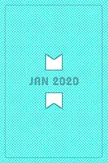

<h1 align="center"> mnemonic </h1>
  
<h2 align="center"> ...can you remember? 🃏</h2>

[the idea](#idea) | [play](#play) | [tech](#tech) | [goals](#goals) | [installation](#installation) | [testing](#testing) | [people](#collaborators) 

## <a name="idea">the idea</a> 

##### [Makers Academy](http://www.makers.tech) - team engineering project

A single-page web app game, based on the classic memory / matching cards game.  Keep your brain in shape!

## <a name="play">play!</a> 🃏

[play on the live link here]()

## <a name="tech">technologies used</a>

* built with: **JavaScript & React.js**

* tested with: **Jest & Enzyme**

* continuous deployment: **Travis CI, coveralls, Heroku**

* remote team collaboration: **Slack, zoom, miro white board**

##### current status:

  

##  <a name="goals">goals & challenges</a>

- [x] build a front-end web application for a classic memory game, so we can have fun playing.

- [x] use and understand React design patterns and its testing frameworks Jest and Enzyme.

- [x] deploy the front-end app to Heroku, with continuous deployment as we are building the project.

- [x] use remote collaboration tools to work in an Agile way, to share our daily learnings, and adapt to changes.

## <a name="installation">installation</a>

##### to install this project to your local machine
`git clone git@github.com:tobydawson1/mnemonic.git` 
`cd mnemonic` 
`npm install`  

##### to play
run `npm start` and your default browser will pop up a window with the game!

## <a name="testing">testing</a>
##### status: all current tests are passing 

- to run the tests run `npm test`
- to see the testing coverage `npm test  -- --coverage --watchAll`

##### a note on testing

Unfortunately testing this project proved to be one of the team's challenges. As all team members were new to using the React library, we chose to focus more on writing features for the game, and less on learning the test frameworks. As a result, at the end of our two week sprint, we have about 50% coverage.

## <a name="collaborators">collaborators</a>

  [Barri](https://github.com/BarriF13) & [Jack](https://github.com/Ovy95) & [Myrtle](https://github.com/Mrtly) & [Toby](https://github.com/tobydawson1)

